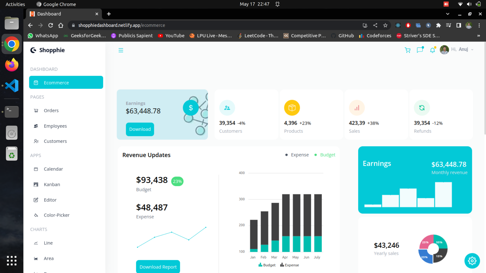
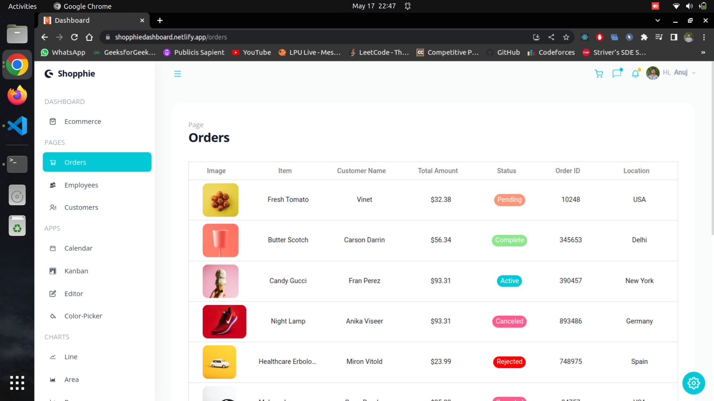
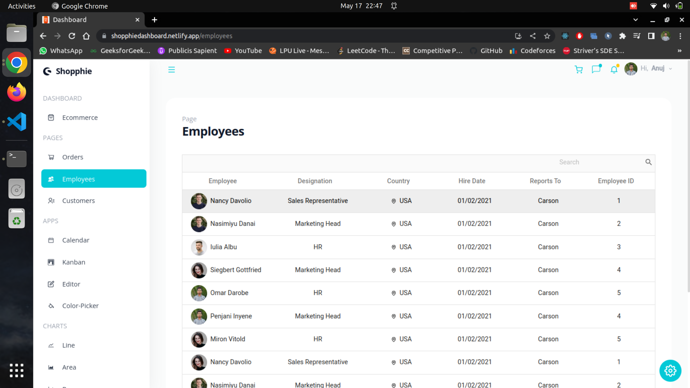
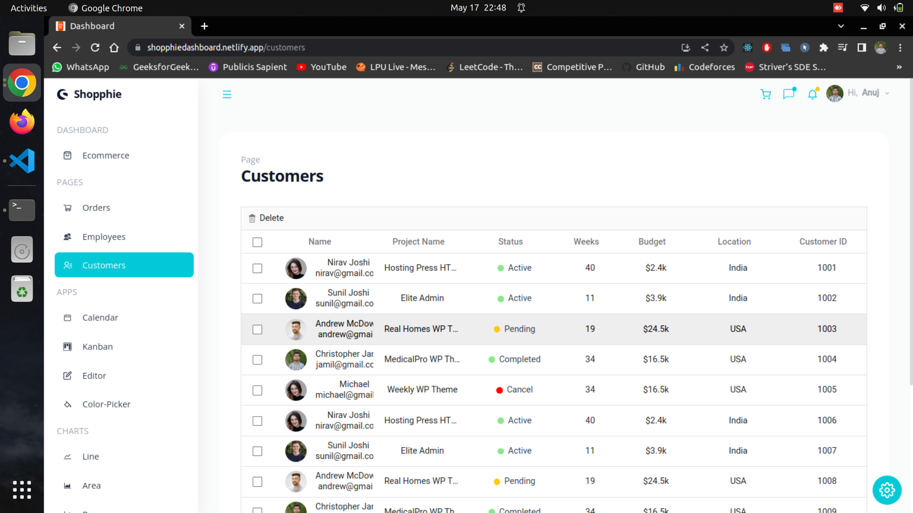
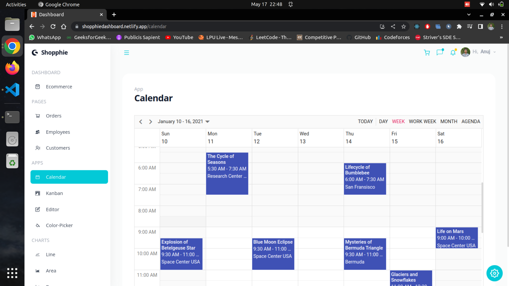
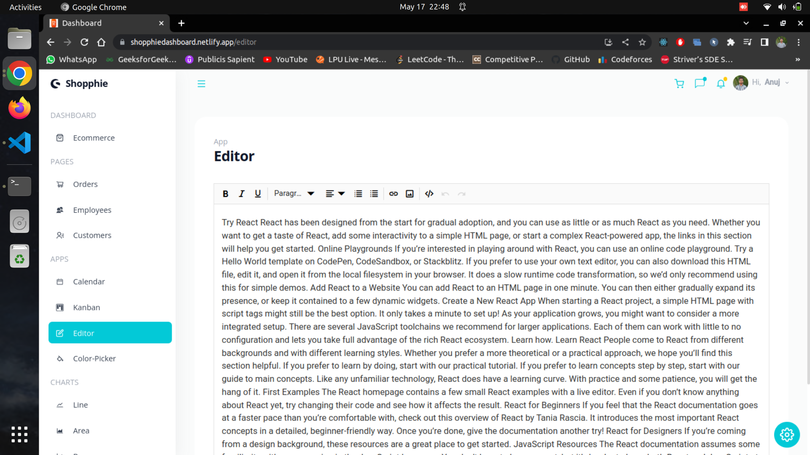
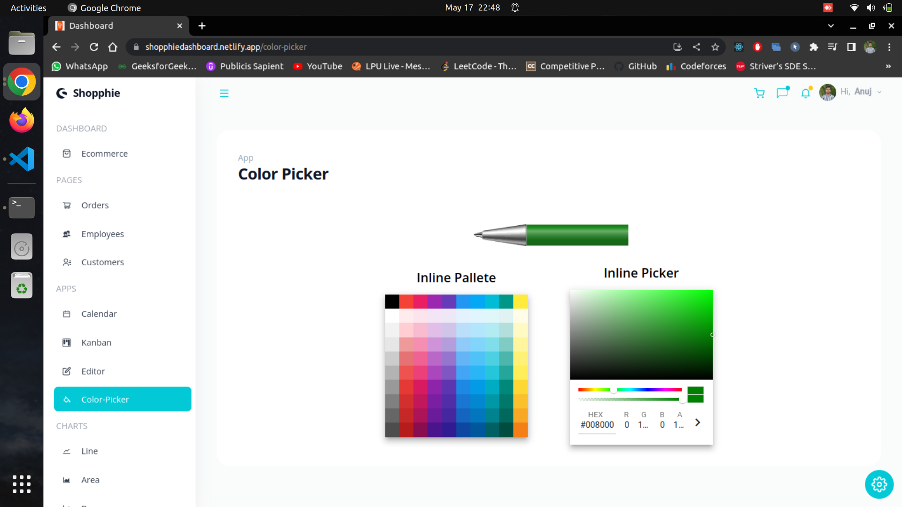
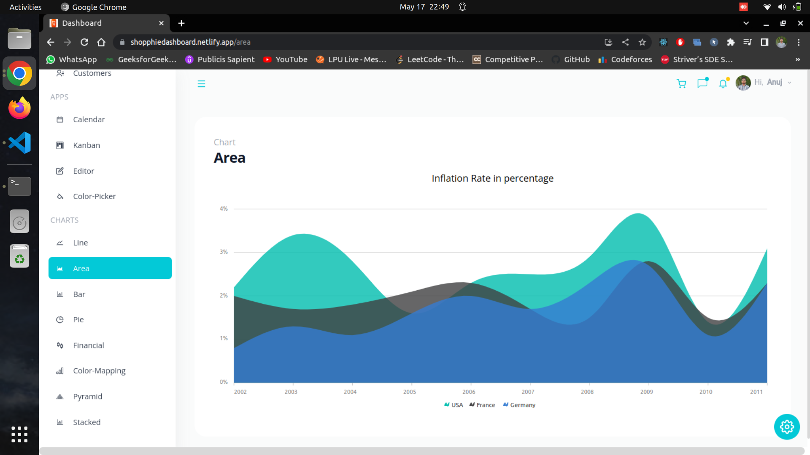
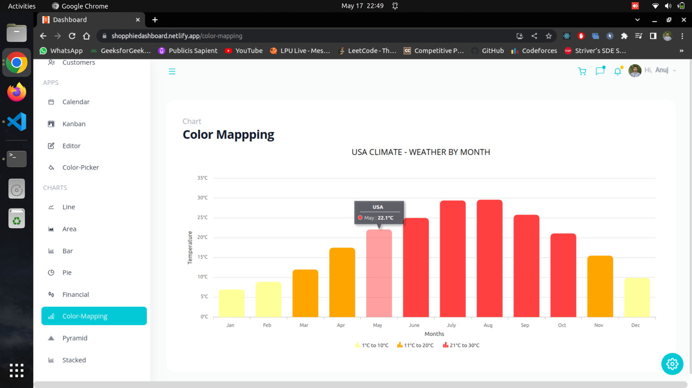
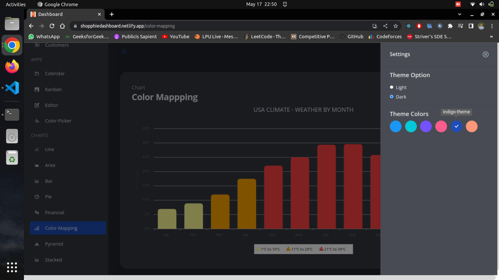

# Introduction
This repository contains a dashboard user interface (UI) built using ReactJS and Syncfusion components. The dashboard UI provides a comprehensive and visually appealing interface for users to interact with the underlying system. [(Preview)](https://shopphiedashboard.netlify.app)

# Installation

* Clone the repository.
``` 
 $ git clone git@github.com:Anuj-Gupta79/DashBoard-UI.git
``` 

* Navigate to the project directory.
``` 
 $ cd dashboard
```

* Install dependencies
```
 $ npm install
```

* Start the application
```
 $ npm start
```

# Usage

* Open your browser and go to http://localhost:3000

# Screenshots

### 1. Landing Page

***

### 2. Order List

***

### 3. Employee List

***

### 4. Customer List 

***

### 5. Calender

***

### 6. Editor

***

### 7. Color Picker

***

### 8. Area Chart

***

### 9. Color Mapping

***

### 10. Light Mode and Dark Mode

***

### 11. Color Theme


